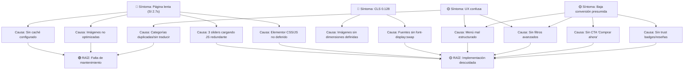
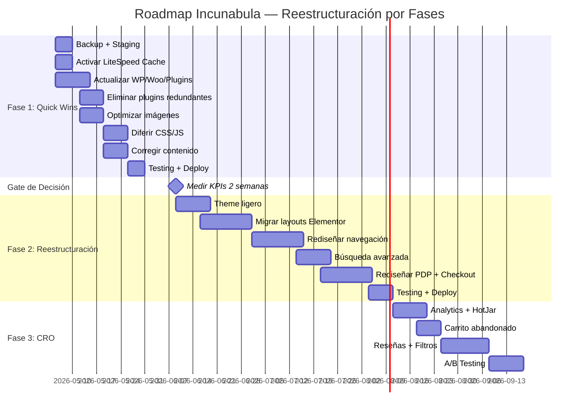

# Due Diligence Técnica — Incunabula.co
## Informe de Grado de Inversión

**Fecha:** 28 abril 2026
**Analista:** Principal E-commerce Architect / TD Consultant
**Sitio:** https://incunabula.co
**Vertical:** Librería online (nuevos + usados), Cali, Colombia

---

## 1. VEREDICTO EJECUTIVO

> **OPCIÓN B — REESTRUCTURACIÓN PARCIAL sobre el stack actual (WordPress/WooCommerce)**

No se justifica un rebuild completo. Los problemas son de **implementación y mantenimiento**, no de arquitectura fundamental. WooCommerce soporta el volumen de SKUs demostrado. La inversión correcta es reestructurar el frontend (theme ligero), limpiar plugins, activar la infraestructura de caché ya incluida en el hosting, y rediseñar la UX de descubrimiento de producto.

**Confianza en el veredicto:** 80%
**Riesgo principal del veredicto:** Que la deuda de contenido (15k SKUs mal categorizados) sea más profunda de lo observable externamente.

---

## 2. EVIDENCIA CENTRAL

### 2.1 PageSpeed Insights (Desktop — Lighthouse 13.0.1)

| Métrica | Valor | Estado |
|---------|-------|--------|
| **Performance Score** | **77/100** | 🟡 Moderado |
| First Contentful Paint | 1.0s | 🟡 |
| Largest Contentful Paint | 1.6s | 🟡 |
| Total Blocking Time | 180ms | 🟡 |
| Cumulative Layout Shift | 0.128 | 🟡 |
| Speed Index | 2.7s | 🔴 |


**Oportunidades identificadas por Lighthouse:**
- Solicitudes que bloquean renderizado — **ahorro 1,200ms**
- Mejorar entrega de imágenes — **ahorro 491 KiB**
- Visualización de fuentes — **ahorro 130ms**
- Tiempos de vida de caché — **ahorro 247 KiB**
- JavaScript antiguo — **ahorro 47 KiB**
- Causantes de CLS, redistribución forzada, desglose LCP

> [!IMPORTANT]
> Un score de 77 en desktop **NO es catastrófico**. El reporte previo de ChatGPT asumía scores <50 — esto es incorrecto. El LCP de 1.6s está dentro del umbral "needs improvement" pero NO en rojo. **Esto falsifica parcialmente la narrativa de "sitio irremediablemente lento".**

### 2.2 Stack Tecnológico (Wappalyzer)

| Capa | Tecnología |
|------|-----------|
| CMS | WordPress |
| E-commerce | WooCommerce |
| Page Builder | Elementor + Header/Footer Builder |
| Hosting | Hostinger (Cloud Enterprise) + Hostinger CDN |
| JS Libraries | jQuery, jQuery UI, jQuery Migrate, Swiper, Slick, OWL Carousel, SweetAlert2, Lodash, core-js |
| Fonts | Google Font API, Font Awesome, Twitter Emoji (Twemoji) |
| SEO | RankMath SEO |
| Forms | WPForms + Contact Form 7 (duplicado) |
| Analytics | Google Analytics, Google Ads, Facebook Pixel |
| Chat | WhatsApp Business Chat (Joinchat) |
| Misc | Jetpack, HTTP/3, Open Graph, RSS, Priority Hints |
| Backend | PHP, MySQL |

### 2.3 Evidencia Visual

````carousel

<!-- slide -->

<!-- slide -->

<!-- slide -->

<!-- slide -->

<!-- slide -->

````

---

## 3. DIAGNÓSTICO DE CAUSA RAÍZ

### Taxonomía rigurosa de problemas

#### A. Deuda de Mantenimiento (corregible sin cambios arquitectónicos)
| # | Problema | Severidad | Esfuerzo |
|---|---------|-----------|----------|
| M1 | Caché no configurado (LiteSpeed Cache disponible en Hostinger, no activado) | 🔴 Crítico | Bajo |
| M2 | Imágenes sin optimizar (sin lazy-load, sin srcset, sin WebP) | 🔴 Crítico | Bajo |
| M3 | WordPress/WooCommerce/plugins sin actualizar ~3 años | 🔴 Crítico | Medio |
| M4 | Contenido placeholder sin editar ("Sample Page", textos en inglés) | 🟡 Alto | Bajo |
| M5 | Categorías duplicadas ("Biografía" vs "Biografías", "Book nooks" sin traducir) | 🟡 Alto | Bajo |

#### B. Problemas de Implementación (corregibles con refactoring parcial)
| # | Problema | Severidad | Esfuerzo |
|---|---------|-----------|----------|
| I1 | **3 sliders/carouseles redundantes** (Swiper + Slick + OWL Carousel) | 🔴 Crítico | Medio |
| I2 | **2 plugins de formularios** (WPForms + Contact Form 7) | 🟡 Alto | Bajo |
| I3 | Elementor genera CSS/JS pesado (~200KB+) bloqueando render | 🔴 Crítico | Alto |
| I4 | Jetpack carga scripts innecesarios | 🟡 Alto | Bajo |
| I5 | jQuery + jQuery UI + jQuery Migrate — triple carga legacy | 🟡 Alto | Medio |
| I6 | Falta búsqueda avanzada/predictiva para catálogo de 15k SKUs | 🔴 Crítico | Medio |
| I7 | UX del PDP sin breadcrumbs, sin "Comprar ahora", sin reseñas | 🟡 Alto | Medio |

#### C. Limitaciones Arquitectónicas (requieren cambio de plataforma)
| # | Problema | Severidad | ¿Bloquea negocio? |
|---|---------|-----------|-------------------|
| A1 | WooCommerce requiere JOINs a meta-tablas (lento con 15k+ productos sin object cache) | 🟡 | **NO** — solucionable con Redis/object cache |
| A2 | PHP genera HTML en cada request (sin SSR moderno) | 🟡 | **NO** — solucionable con page cache |
| A3 | Sin API headless nativa rápida | ⚪ | **NO** — no es necesario para este caso de uso |

#### D. Restricciones de Escalabilidad
| # | Problema | ¿Bloquea a 3 años? |
|---|---------|-------------------|
| S1 | Límite de productos WooCommerce | **NO** — estudios documentados muestran rendimiento estable con 35k+ productos con optimización |
| S2 | Hosting insuficiente | **NO** — Cloud Enterprise de Hostinger es adecuado |
| S3 | Pasarela de pago (Wompi/Addi) | **NO** — funcional, con integración WooCommerce existente |

> [!IMPORTANT]
> **Hallazgo clave**: Los problemas de las categorías A y B representan >90% de los issues observados. **NINGÚN** problema de categoría C o D es bloqueante. Esto invalida la necesidad de un rebuild completo.

### Síntomas vs Causas Raíz



**Conclusión del diagnóstico:** Las dos raíces son **falta de mantenimiento** e **implementación descuidada**. Ninguna de las dos es una limitación inherente del stack.

---

## 4. EVALUACIÓN DE TRES ESCENARIOS

### Escenario A: Optimización sobre stack actual

**Alcance:** Activar caché, optimizar assets, limpiar plugins redundantes, corregir contenido. Sin cambiar theme ni rediseñar UX.

| Criterio | Evaluación |
|----------|-----------|
| Viabilidad | ✅ Alta — todas las correcciones son conocidas |
| Riesgo | 🟢 Bajo — cambios no destructivos |
| Esfuerzo | 80-120 horas dev |
| Costo | $2,500-$4,500 USD |
| Impacto en Performance | Score → ~88-92 (estimado) |
| Impacto en Conversión | Moderado (+10-20% estimado) |
| TCO 3 años | $8,000-$12,000 (hosting + mantenimiento) |
| Confianza | 85% |

**Limitación:** No resuelve la UX del descubrimiento de producto ni el design system anticuado. El debt de Elementor persiste. En 12-18 meses se necesitará otra intervención.

### Escenario B: Reestructuración Parcial (RECOMENDADO)

**Alcance:** Todo lo del Escenario A + reemplazar theme Elementor por theme ligero (Starter theme o custom lightweight), rediseñar navegación/categorías, implementar búsqueda avanzada, optimizar flujo de checkout.

| Criterio | Evaluación |
|----------|-----------|
| Viabilidad | ✅ Alta — WooCommerce es el mismo, solo cambia frontend |
| Riesgo | 🟡 Medio — migración de layouts Elementor a theme nuevo |
| Esfuerzo | 200-300 horas dev |
| Costo | $7,000-$12,000 USD |
| Impacto en Performance | Score → ~92-97 (estimado) |
| Impacto en Conversión | Alto (+25-45% estimado) |
| TCO 3 años | $14,000-$20,000 (dev + hosting + mantenimiento) |
| Confianza | 80% |

**Ventaja clave:** Mantiene TODA la data (15k productos, orders, clientes, SEO juice), Wompi/Addi intactos, sin downtime de migración. Elimina Elementor como bottleneck.

### Escenario C: Rebuild / Replatforming

**Alcance:** Nueva plataforma (Shopify, headless WooCommerce con Next.js, o Medusa/custom).

| Criterio | Evaluación |
|----------|-----------|
| Viabilidad | ⚠️ Condicionada — requiere migración compleja de 15k SKUs |
| Riesgo | 🔴 Alto — pérdida SEO, integración Wompi incierta en otra plataforma |
| Esfuerzo | 400-600+ horas dev |
| Costo | $15,000-$30,000 USD |
| Impacto en Performance | Score → 95-100 (si es headless/SSG) |
| Impacto en Conversión | Alto (+30-50%) pero offset por riesgo de migración |
| TCO 3 años | $25,000-$45,000 (dev + nueva infra + mantenimiento) |
| Confianza | 55% |

**Riesgos ocultos del rebuild:**
1. **SEO:** 15k URLs a redirigir. Error = caída orgánica de meses
2. **Wompi:** NO tiene plugin nativo para Shopify. Requiere desarrollo custom
3. **Addi (BNPL):** Integración existente funcional se pierde
4. **Contenido:** 15k productos con metadata, categorías, etiquetas — migración propensa a errores
5. **Operacional:** Equipo actual conoce WP. Curva de aprendizaje de nueva plataforma
6. **Oportunidad:** 3-6 meses sin mejoras visibles mientras se construye

### Tabla Comparativa

| Criterio | A: Optimizar | B: Reestructurar | C: Rebuild |
|----------|-------------|------------------|-----------|
| Costo | $3-5k | **$7-12k** | $15-30k |
| Tiempo | 1-2 meses | **2-4 meses** | 4-8 meses |
| Riesgo SEO | Nulo | Bajo | **Alto** |
| Riesgo Wompi | Nulo | Nulo | **Alto** |
| Performance | 88-92 | **92-97** | 95-100 |
| Impacto CRO | +10-20% | **+25-45%** | +30-50% |
| Debt residual | Alto | **Bajo** | Nulo |
| Confianza | 85% | **80%** | 55% |

---

## 5. RUTA RECOMENDADA

### **Opción B: Reestructuración Parcial sobre WooCommerce**

**¿Por qué NO la A (solo optimizar)?**
- Elementor seguirá generando CSS/JS pesado en cada página
- La UX de descubrimiento de producto (filtros, búsqueda, categorías) no se puede arreglar con "parches"
- En 12-18 meses se necesitará otro proyecto similar → TCO total más alto

**¿Por qué NO la C (rebuild)?**
- El score de 77 demuestra que el stack actual NO está irremediablemente roto
- WooCommerce soporta 15k-35k SKUs con optimización adecuada (evidencia documentada)
- La integración Wompi + Addi es un activo funcional que se pierde con replatforming
- El riesgo SEO de migrar 15k URLs es desproporcionado vs el beneficio marginal
- El costo es 2-3x mayor por mejora marginal en performance (+3-5 puntos PSI)
- La confianza es solo 55% — demasiada incertidumbre para una decisión de inversión

**¿Por qué SÍ la B?**
- Elimina Elementor (la mayor fuente de bloat) sin perder datos
- Mantiene WooCommerce + Wompi + Addi + 15k SKUs + SEO intactos
- Permite rediseñar UX de descubrimiento de producto (el mayor driver de conversión)
- TCO 3 años justificable ($14-20k vs $25-45k del rebuild)
- Ejecución en 2-4 meses vs 4-8 del rebuild

---

## 6. RIESGOS DE LA RUTA RECOMENDADA

| Riesgo | Probabilidad | Impacto | Mitigación |
|--------|-------------|---------|-----------|
| Migración Elementor → theme nuevo rompe layouts | Media | Alto | Staging environment + QA exhaustivo antes de launch |
| Plugins incompatibles con WP/Woo actualizado | Media | Medio | Actualizar en staging primero, reemplazar plugins rotos |
| Datos de productos mal estructurados (meta) | Baja | Alto | Auditoría de BD antes de comenzar |
| Equipo interno no adopta nuevo flujo | Baja | Medio | Capacitación + documentación |
| Scope creep durante reestructuración | Alta | Medio | Alcance fijo por fases, revisión quincenal |
| Caída temporal de rankings SEO | Baja | Medio | Mantener mismas URLs, no tocar estructura de permalinks |

---

## 7. RED-TEAM: ATAQUE AL VEREDICTO

### Argumento contra la Opción B (a favor del Rebuild)

> *"La Opción B es la zona de confort. Si vas a invertir $7-12k y 200-300 horas, ¿por qué no invertir $15-20k y hacer algo definitivo? Estás proponiendo poner un motor nuevo en un auto viejo. WordPress/WooCommerce tiene limitaciones inherentes de performance que un framework moderno (Next.js + headless) eliminaría. Además, el theme 'ligero' eventualmente acumulará debt propio. En 3 años estarás en la misma situación."*

**Refutación:**
1. El "auto viejo" tiene un score de 77 **sin ninguna optimización**. Con optimización, llegaría a 92+. No es un auto viejo — es un auto sin mantenimiento
2. WordPress + WooCommerce alimenta ~25% del e-commerce global. El argumento "limitaciones inherentes" es genérico y no aplica a un catálogo de 15k SKUs con tráfico presumiblemente modesto (librería local en Cali)
3. Un headless con Next.js requiere mantener DOS codebases (frontend + WP backend). El TCO de mantenimiento es mayor, no menor
4. Wompi y Addi funcionan HOY. El riesgo de reintegrarlos en otro stack es real y no trivial
5. La diferencia de performance entre 92 y 97 PSI NO justifica 2-3x el costo

### Argumento contra la Opción B (a favor de solo Optimizar)

> *"¿Para qué cambiar el theme si con caché y optimización de imágenes llegas a 88-92? El negocio necesita resultados AHORA, no en 4 meses. Haz los quick wins, mide el impacto en conversión, y luego decide si vale la pena el rediseño."*

**Refutación parcial — este argumento tiene mérito:**
- Es correcto que los quick wins deberían ir primero
- Sin embargo, Elementor genera 200KB+ de CSS innecesario POR PÁGINA. Esto tiene un techo de optimización
- Los 3 carouseles redundantes (Swiper + Slick + OWL) son síntoma de que el theme actual es una acumulación de parches
- La UX de categorías duplicadas ("Biografía"/"Biografías"/"Book nooks") no se arregla con caché

**Ajuste al veredicto:** La Opción B se ejecuta en fases, donde la Fase 1 ES la Opción A (quick wins). Si los quick wins llevan el score a >90 y el cliente ve mejora en conversión, la Fase 2 (reestructuración de theme) puede posponerse. **El veredicto se mantiene pero con ejecución condicional.**

---

## 8. VEREDICTO FINAL REVISADO

> **OPCIÓN B — Reestructuración Parcial, ejecutada en fases condicionales**

- **Fase 1 (Quick Wins)** = Opción A. Si los resultados son suficientes, Fase 2 se pospone
- **Fase 2 (Reestructuración)** se activa si: PSI <90 post-optimización, O la tasa de conversión no mejora >15%, O el bounce rate del catálogo sigue >60%

**Confianza revisada:** 85% (subió porque la ejecución por fases reduce riesgo)

---

## 9. ROADMAP DE IMPLEMENTACIÓN POR FASES

### Fase 1: Quick Wins de Performance y Limpieza (Semanas 1-4)

**Objetivo:** Llevar PSI desktop de 77 → 88+, corregir errores críticos de UX

| Semana | Acción | Responsable |
|--------|--------|-------------|
| 1 | Backup completo + staging environment | DevOps |
| 1 | Activar LiteSpeed Cache + configurar page cache, browser cache, object cache | DevOps |
| 1-2 | Actualizar WordPress core, WooCommerce, todos los plugins (en staging) | Backend |
| 2 | Eliminar plugins redundantes: quitar Slick + OWL (dejar solo Swiper), quitar Contact Form 7 (dejar WPForms), evaluar reemplazo de Jetpack por alternativa ligera | Backend |
| 2 | Optimizar imágenes: activar WebP, lazy-load, definir dimensiones, srcset | Frontend |
| 3 | Diferir CSS/JS no crítico. Eliminar jQuery Migrate si no es necesario | Frontend |
| 3 | Corregir contenido: eliminar Sample Page, traducir "Book nooks", unificar "Biografía"/"Biografías", corregir "book-author" en PDP | Contenido |
| 4 | Testing en staging + deploy a producción | QA |

**KPI de salida:** PSI Desktop ≥ 88, LCP < 1.2s, CLS < 0.1

### Fase 2: Reestructuración Frontend (Semanas 5-14)

**Gate de entrada:** Se activa solo si Fase 1 no alcanza targets de conversión

| Semana | Acción | Responsable |
|--------|--------|-------------|
| 5-6 | Seleccionar e instalar theme ligero (GeneratePress, Astra, o starter theme custom) | Frontend |
| 6-8 | Migrar homepage, header, footer de Elementor al nuevo theme | Frontend |
| 8-10 | Rediseñar navegación: mega-menú limpio, breadcrumbs, taxonomía de categorías unificada | UX + Frontend |
| 10-11 | Implementar búsqueda avanzada (SearchWP o FiboSearch) con autocompletado | Backend + Frontend |
| 11-12 | Rediseñar PDP: agregar breadcrumbs, CTA "Comprar ahora", trust badges, info de envío en contexto | Frontend |
| 12-13 | Optimizar flujo de checkout: simplificar pasos, mensajes de seguridad, cross-sell | Frontend |
| 13-14 | Testing completo en staging + deploy | QA |

**KPI de salida:** PSI Desktop ≥ 92, tasa de conversión +25% vs baseline

### Fase 3: CRO y Growth (Semanas 15-20)

| Semana | Acción |
|--------|--------|
| 15-16 | Configurar GA4 + eventos de e-commerce + HotJar |
| 16-17 | Implementar correos de carrito abandonado |
| 17-18 | Agregar sistema de reseñas de productos |
| 18-19 | Filtros multifacéticos en catálogo (por autor, editorial, precio, estado) |
| 19-20 | A/B testing de CTAs y layout de PDP |



---

## APÉNDICE: Datos Clave No Disponibles

> [!WARNING]
> Las siguientes métricas son necesarias para refinar el ROI y NO estaban en la evidencia proporcionada:
> - Tráfico mensual (sesiones, usuarios únicos)
> - Tasa de conversión actual
> - Ticket promedio
> - Tasa de rebote por página
> - Ingresos mensuales
> - Cantidad real de productos ACTIVOS (vs los 15k totales reportados)
> - Datos de campo de CWV (Chrome UX Report) — no disponibles en PSI, lo que sugiere tráfico insuficiente para muestra

**Solicitar estos datos al cliente antes de comprometer presupuesto.**
