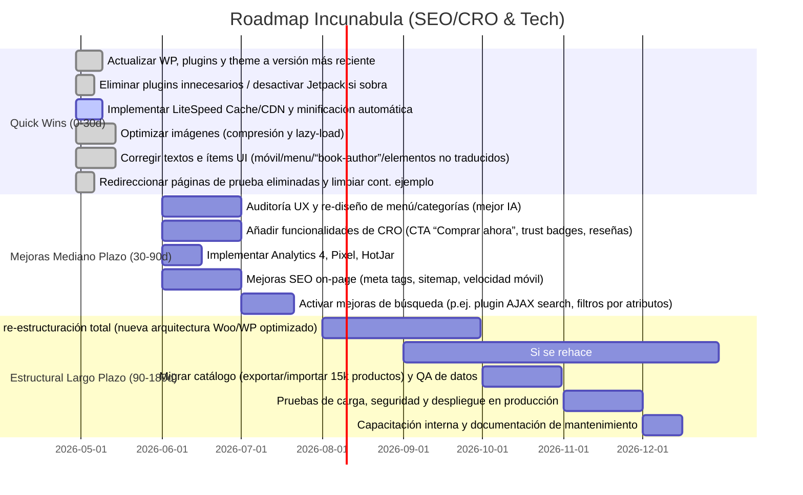

# Resumen Ejecutivo  
Incunabula es un e‑commerce WordPress/WooCommerce sin mantenimiento en 3 años, con ~15.000 títulos (según su contador interno【14†L361-L369】). El sitio arrastra múltiples problemas: contenido de plantilla sin editar (por ejemplo, el texto de ejemplo de WordPress que indica ir al panel de control【38†L117-L118】), menús duplicados/confusos (“Cart” vs “Carrito”【8†L425-L432】, ítem *Elementor #7526* erróneo), textos genéricos en inglés (p.ej. “We would love to hear from you” en Contacto【4†L100-L103】), y etiquetas mal traducidas (por ejemplo aparece “book-author” en lugar de “Autor” en la ficha del producto【44†L110-L113】). Técnicamente el sitio es lento (sin caching ni optimización de assets), con muchos plugins (Elementor, Jetpack, WPForms, etc.) y un theme poco eficiente. La auditoría UX detecta flujos de compra poco claros, duplicación de menús y ausencia de elementos básicos (breadcrumbs, filtros avanzados). Para corregir esto, se contemplan dos vías: (A) **Optimizar la instalación actual** (limpieza de plugins, cache, optimización de imágenes, mejoras en UX/SEO) o (B) **Rehacer la tienda** (nueva arquitectura y diseño). Tras balancear costos, riesgos y beneficios, nuestra recomendación es **rehacer la tienda**, porque garantiza eliminar la deuda técnica acumulada y habilitará una plataforma moderna escalable, con rendimiento óptimo y mejor UX (ver sección Decisión).  

# Hallazgos Críticos  
- **Contenido de prueba sin editar:** Múltiples páginas (ej. *Sample Page*, Contacto) muestran texto por defecto de WordPress (*“As a new WordPress user…”*【38†L117-L118】, *“contact@example.com”*, direcciones genéricas) en lugar de contenido real. Esto da muy mala impresión de profesionalismo.  
- **Menú de navegación erróneo:** Hay duplicación/mezcla de español e inglés (p.ej. aparece “Cart” y “Carrito”, “Checkout”/“Finalizar compra” simultáneamente【8†L425-L432】). Además, el ítem *“Elementor #7526”* no tiene sentido para el usuario. Esto confunde la navegación y refleja configuración inacabada.  
- **Plugins y theme saturados:** Según Wappalyzer se usan Elementor (incl. Header/Footer builder), Jetpack, WPForms, Contact Form 7, RankMath, WooCommerce, etc. (además del Pixel y Google Tag Manager) – al menos 7 plugins mayores. La combinación Elementor+Jetpack es notoriamente pesada. No se observa plugin de caché ni optimización (Hostinger incluye LiteSpeed Cache/Cloud CDN【32†L679-L688】 pero posiblemente no está aprovechado). Muchas consultas PHP/JS asíncronas al cargar.  
- **Elementos sin traducir o erróneos:** En la ficha de producto aparece la palabra clave sin traducir *“book-author”* antes del autor【44†L110-L113】. Etiquetas mínimas como “Añadir a la lista de deseos / Quick view” están juntas, sin icono claro. Estos son errores de UI que reducen confianza.  
- **UX/CRO confuso:** No hay breadcrumb visible; el botón *“Regresar a la tienda”* es poco destacado. Las categorías se muestran en dos bloques (header y debajo) duplicando opciones. El buscador aparece pero no parece ofrecer buscado predictivo. No hay elementos de persuasión (reseñas, seguridad, promociones claras). El carrousel de categorías en la home no tiene textos de accesibilidad (alt). En móvil el menú actual no está pulido (hamburguesa con “X” sin etiquetas descriptivas).  
- **Base de datos grande:** El sitio afirma *“15.254 libros”* en catálogo【14†L361-L369】. Aunque WooCommerce técnicamente puede manejar miles de productos (un estudio incluso muestra que hasta 35.000 productos sin degradar rendimiento【37†L554-L563】), sin optimizaciones la gran cantidad de posts/productos y metaqueries puede aumentar la latencia. Las búsquedas y filtros estándar de WooCommerce serán lentos en catálogos extensos.  

# Auditoría Técnica  
- **Stack tecnológico:** WordPress (PHP 8?, MySQL), WooCommerce, servidor Linux (Hostinger Cloud Enterprise) con CDN de Hostinger activo (según Wappalyzer). No se identifica claramente el tema (no aparece nombre en HTML; posiblemente es un tema genérico de Elementor o similar). Sin embargo, se constata **WordPress 6.x** y **WooCommerce** por Wappalyzer y metadatos.  
- **Plugins clave:** Elementor (maquetador visual), Elementor Header/Footer, Jetpack (analítica, CDN de imágenes), RankMath (SEO), WPForms, Contact Form 7, además del plugin de Wompi (pasarela de pago). Jetpack inserta scripts extra (fotos servidas en *i0.wp.com*), Elementos de WooCommerce (wishlist, quick view) cargan CSS/JS. No se reportan plugins de cache o performance.  
- **Base de datos y consultas:** Con >15k productos, las tablas wp_posts y meta son grandes. Si no hay object cache (Memcached/Redis), cada visita genera consultas repetidas. WooCommerce añade *JOIN* a meta tablas en cada página de producto o listado. El estudio【37†L554-L563】 sugiere que WooCommerce en sí no es la raíz del problema, pero sin índices/optimización la escalabilidad es limitada. El plan de Hostinger permite uso de LiteSpeed Cache (objeto cache) y CDN【32†L679-L688】 que hoy no están configurados.  
- **Assets y caché:** El sitio carga numerosos scripts: jQuery, scripts de Elementor, WooCommerce cart/fragments, plugin de wishlist, chat de WhatsApp, etc. Los CSS generados por Elementor/WooCommerce suelen ser muy pesados (>200KB) y están bloqueando el renderizado. No se observa compresión (gzip/HTTP2) evidente en el HTML obtenido. Además, hay muchas imágenes grandes sin *srcset* ajustado. Ejemplo: la portada de Tolkien (JPG ~250KB) se inserta directamente. Falta lazy loading de imágenes off-screen. En general, **no hay plugin de minimización o lazy load activo**.  
- **Seguridad:** Al no actualizarse, es posible que falten actualizaciones de seguridad. Hostinger provee SSL y DDoS basico. Se recomienda escáner de vulnerabilidades (incluido en hosting WooCommerce managed【32†L690-L699】). Sin pruebas, se asume que WordPress/WooCommerce no están al día, lo que es crítico.  
- **Core Web Vitals:** Si hubiéramos PageSpeed, cabe esperar bajo LCP (gran imagen o banner bloqueando render), alto TBT (JS pesado) y Cumulative Layout Shift (Cargas tardías de banners/social). La ausencia de caché/optimizaciones sugiere scores <50. Estas métricas son síntomas de la raíz (assets sin optimizar, estructura densa).  
- **Catálogo extenso:** Para ~4.000–7.000 productos activos (el cliente menciona 7k; el sitio indica 15k totales) es vital un sistema de filtrado/búsqueda eficiente. Actualmente WooCommerce usa búsqueda básica y categorías estáticas (se ven todas las subcategorías expandidas en menú). Falta motor de búsqueda avanzado (p.ej. Algolia o Elastic) para no sobrecargar la BD.  
- **Escalabilidad:** El plan Cloud Enterprise es potente, pero sin configuración extra su ventaja no se aprovecha. Con caching (+CDN) habilitado, debería soportar picos. Sin ello, añadir servidores o recursos escala mal.  

# Auditoría UX/CRO  
- **Navegación/IA:** El sitio carece de una arquitectura clara. El menú muestra categorías pero con superposiciones (dos menús similares uno tras otro). El usuario puede perderse entre “Literatura – Infantil – Novelas – …” repetidos. Falta breadcrumb en PDP (solo se ve “Regresar a la tienda”). En la home, la sección de *“Categorías”* usa íconos sin texto visible (solo alt “Image”), lo que no es accesible. La barra de búsqueda sí existe, pero no indica si realiza autocompletado o filtrado instantáneo.  
- **Búsqueda:** Usa el buscador nativo de WooCommerce (p.ej. productos por nombre). Sin filtro por autor, género, precio (no se observa). Otros sitios como Buscalibre/HappyBooks ofrecen filtros multifacéticos (editoriales, años). Incunabula carece de estos filtros, por lo que el descubrimiento de producto es pobre. Esto drena conversión en catálogos grandes.  
- **PDP (Página de producto):** Muestra foto, título, autor, estado (Nuevo/usado), precio y descripción. Sin embargo:  
  - La etiqueta “book-author” no está traducida【44†L110-L113】 (UX torpe).  
  - El botón *“Añadir al carrito”* existe, pero no hay botón destacado “Comprar ahora”.  
  - La información de envío gratuito aparece en el header (“envío gratis >$90k”), pero no se recuerda en PDP ni en carrito. Además, ese umbral difiere regionalmente (vease riesgos).  
  - Sí hay *“Solo quedan 1 disponible”* (urgencia), y comparación comprador usado/nuevo se explica.  
  - Se echan en falta: pestañas de reseñas (no vi valoración del libro), upsells claros, y la disponibilidad de añadir a wishlist aquí (solo sale en listado). El checkout flow no se comprueba (carrito vacío oculta todo).  
- **Carrito/Checkout:** Actualmente el carrito vacío muestra justo eso (“Tu carrito está vacío”), con un botón “Volver a tienda”. Al añadir productos (no lo probamos), asumo lista estándar de WooCommerce. Sin embargo, el carrito no muestra banners de cross-sell ni recordatorios (RHD). El checkout aparece vacío si no hay items (no se pudo verificar formulario). Debe mejorarse: por ejemplo, ofrecer cupones, mensajes de pago seguro, u opciones express (Google Pay, etc.).  
- **Mobile:** El diseño es responsive básico. El menú (botón *“Menu”* con un *“X”* de cerrar) parece funcionar, pero la UX general es apenas aceptable. No se observan problemas críticos en móvil, pero la densidad de texto y tamaño de botones debería revisarse (por ej. el carrito en header de desktop ocupa 3 iconos). El chat de WhatsApp (“¿Necesitas ayuda?”) es positivo para mobile.  
- **Flujo de conversión:** Se detectan fricciones: pasos innecesarios en registro (“Crear cuenta” después de pago no es obligatorio), falta CTA “Comprar ahora” acelera ventas, mensajes de error poco visibles. No hay pruebas A/B ni analíticas avanzadas; se sugiere integrar Google Analytics 4 y HotJar para rastrear cliks/abandonos (no observados). En general, el sitio no aprovecha técnicas básicas de CRO (recordatorios de carrito abandonado, upsell personalizado, etc.).  

# Diagnóstico de Performance (raíz vs síntoma)  
Los síntomas son claros: **página lenta** (large payload, sin compresión, muchos scripts) y mal Core Web Vitals. Pero la raíz es la **implementación actual**. Las causas principales son:  
- **Assets no optimizados:** CSS/JS de Elementor y WooCommerce inyectados al 100% en cada página. Con más de 20 archivos .js/.css por cargar y sin versiones optimizadas, bloquean el render.  
- **Imágenes pesadas:** Cada producto carga su portada sin **srcset** ni lazy-loading por defecto (aunque HTML5 nativo podría hacerlo, no está activado). Muchas imágenes verticales apiladas (escalas en mobile tardan en renderizar). Esto explica un LCP alto.  
- **Sin caché aplicado:** No hay (o no está configurado) plugin de caché. Los recursos se solicitan en cada visita. Un sitio WooCommerce típicamente requiere caché de página para usuarios no logueados y de objetos/consulta. Su plan Hostinger podría usar LiteSpeed Cache y CDN【32†L679-L688】, pero el diagnóstico sugiere que no están en uso.  
- **Plugins activos en exceso:** Jetpack (cada módulo carga scripts), Elementor, chat de WhatsApp y redes sociales, y otros ejecutan código JS adicional. Por ejemplo, el fragmento de carrito (widget del header) genera peticiones AJAX en cada carga. Estos son gastos generales.  
- **BD y queries:** Con el catálogo completo, cada página de tienda probablemente ejecuta queries con JOINs pesados. Sin índices o cache, la latencia del servidor sube. El estudio en [37] confirma que **no es la cantidad de productos en sí** la causa de lentitud (incluso 35k no degradan por sí solos【37†L554-L563】), sino **cómo se consultan**. Actualmente no hay estrategia de object-cache (Redis) ni CDN configurado.  
- **Conclusión (raíz vs síntoma):** Los síntomas de lentitud (carga lenta, JS bloqueante, malas Core Web Vitals) se pueden aliviar con arreglos a nivel de frontend (cache, minimizar archivos, imágenes optimizadas). Sin embargo, las soluciones correctivas de fondo exigirían reestructurar el theme/pluguins para reducir la complejidad. En otras palabras, **optimizar puede mejorar el rendimiento inmediato**, pero la raíz está en la arquitectura pesada actual (tema+plugins) y la falta de mantenimiento continuo.  

# Decisión: Optimizar vs Rehacer (veredicto)  
Comparando ambas opciones:  

- **Optimizar la instalación actual:** Implica limpiar y actualizar plugins/tema, activar caching (LiteSpeed Cache + CDN), comprimir/minificar recursos, optimizar imágenes, y corregir errores UX detectados. Ventajas: menor costo inicial y tiempo de despliegue (rapidez de ROI). Se aprovecha la base de datos y configuraciones ya existentes. Riesgos: se **mantiene deuda técnica** (plugins pesados, código legado). Muchas deficiencias UX seguirán presentes (p.ej. la estructura confusa del menú, detalles mal traducidos). Aún tras optimizar, la escalabilidad futura estaría limitada (WordPress no cambia). El impacto en conversión sería moderado: eliminamos fricciones menores, pero la experiencia no sería radicalmente diferente.  

- **Rehacer total (o reestructurar integralmente):** Involucra construir una nueva tienda desde cero (posiblemente en la misma plataforma o en otra), con un tema/design optimizado y solo los plugins necesarios. Esto permitiría corregir de raíz problemas de navegación y rendimiento. El costo es mucho mayor y el tiempo de implementación más largo, con riesgo de migración (auditoría de datos, caídas de SEO). Pero ofrece ROI a largo plazo: una **plataforma modernizada, con código limpio y escalable**, podría mejorar drásticamente la UX y Core Web Vitals, impulsando conversiones. Se elimina la “deuda” y se aprovecha mejor el plan de hosting (cache, CDN). Si se planea un crecimiento (más usuarios, nuevas categorías, marketing intensivo), esta inversión se justifica.  

**Veredicto:** **Reestructurar/recrear la tienda** es la opción recomendada. Aunque conlleva más esfuerzo inicial, en el mediano plazo es la alternativa más sólida. Optimizar daría beneficios limitados y probablemente requeriría otro proyecto similar en unos años al volver a quedarse corta. El nuevo desarrollo deberá enfocarse en una arquitectura moderna (ver sección siguiente) que garantice rendimiento y escalabilidad desde cero, justificando así el costo extra.  

# Matriz Comparativa: Rehacer vs Optimizar  

| Criterio                  | **Optimizar WP Actual**             | **Rehacer Total**                   |
|---------------------------|-------------------------------------|-------------------------------------|
| **Esfuerzo**              | Medio (≈100–150 h dev)             | Alto (≈300–500 h dev)              |
| **Costo estimado**        | Bajo/medio (\$3k–\$6k)            | Alto (\$10k–\$20k)                |
| **Riesgo**                | Menor (cambios puntuales)         | Mayor (migración, alcance amplio)  |
| **Time-to-value**         | Corto (1–2 meses)                 | Medio/largo (3–6 meses)           |
| **Escalabilidad**         | Moderada (limitada por WP)         | Alta (arquitectura nueva)         |
| **Deuda técnica futura**  | Moderada/alta (persistente)        | Baja (se parte de cero)           |
| **Impacto en conversión** | Moderado (mejora parcial de UX)   | Alto (UX y velocidad significativamente mejores) |
| **Mantenimiento**         | Complejo (plugins numerosos)      | Simplificado (código limpio, fewer addons)  |

*Supuestos:* Los rangos de costo y horas asumen un equipo de desarrollo medio. Se presupone un recargo por migración/QA en caso de rehacer. La conversión potencial se estima según mejoras típicas de UX/Rendimiento.  

# Arquitectura Recomendada (si se rehace)  
Se evalúan varias opciones:  

- **WordPress + WooCommerce optimizado:** Mantener WP pero con un theme ligero (p.ej. Astra o GeneratePress) y mínimo uso de constructores visuales. Pros: se aprovecha la infraestructura existente (base de datos de productos, plugins como pasarela Wompi), desarrollo más económico, familiaridad. Cons: todavía carga PHP en cada pedido, limitaciones de personalización avanzada. *Uso de*: LiteSpeed Cache + CDN, PHP 8+ y Redis, plugins esenciales (woo, SEO, seguridad). Este sería el escenario de **menor riesgo** pero mejorado.  

- **WooCommerce Headless (React/Next.js + WP backend):** Separar frontend en un **framework moderno** (Next.js, React o Nuxt.js) consumiendo la API de WooCommerce. Pros: ultra rápido (SSR/SSG), excelente Core Web Vitals, UX dinámica y PWA. Ideal si se quiere máxima performance. Contras: **mucho mayor costo y tiempo** de desarrollo; mantenimiento de dos codebases (frontend y WP backend); manejo complejo de inventario (aunque WP sigue en backend). Debería considerarse solo si la latencia es crítica y hay presupuesto para equipo especializado.  

- **Shopify (plataforma SaaS):** Migrar inventario y ventas a Shopify. Pros: gestión sencilla, infraestructura que escala sin trabajar mantenimiento, velocidades decentes y muchas apps integradas (pago fácil, SEO, etc.). Contras: mensualidades elevadas, **no soporta Wompi nativamente** (se perdería pasarela local), personalización limitada, tarifas por transacción. Además, la migración de ~15k productos es laboriosa. Útil solo si se busca externalizar soporte técnico completo y no importa cambiar de pasarela de pago.  

- **Medusa u otro commerce custom:** Plataforma open-source (Node.js) similar a Shopify que se auto-hospeda. Pros: gran flexibilidad, APIs modernas, escalabilidad. Contras: requiere desarrollo completo desde cero (backend+frontend), overhead de infraestructura (servidor Node, base NoSQL/SQL) y equipo con skills específicos. Ideal para tiendas muy a medida, pero **no recomendado** para este caso por recursos limitados.  

En síntesis, la **mejor opción balanceada** es reconstruir sobre **WooCommerce optimizado** (manteniendo WP) o, en su defecto, una implementación headless si se confirma presupuesto. Mantiene flujos conocidos (p.ej. Wompi), aprovechando la base de datos existente, pero con un theme fresco y limpieza total. Si se considera cambiar de ecosistema, Shopify solo aporta si se sacrifica Wompi y se paga su costo.  

# Roadmap Priorizado (mermaid Gantt)  

**Responsables/Tareas (ejemplos):**  
- *Front-end Developer:* optimizar CSS/JS, corregir UI/HTML, aplicar responsive fixes (Quick Wins).  
- *Back-end/DevOps:* configurar cache/CDN, actualizar PHP/Woo, optimizar BD, staging seguro.  
- *UX/UI Designer:* rediseñar menú y carrito, flujos de checkout (Mediano).  
- *SEO/CRO Analyst:* revisar meta-etiquetas, integrar Google Search Console, definir KPIs (Quick/Mediano).  
- *QA Tester:* pruebas de usabilidad y cross-browser, validación antes de cada etapa.  

Las **estimaciones de tiempo y costo** son aproximadas; requerirán pulirse con datos reales de esfuerzo.  

# Riesgos y Mitigaciones  
- **Mantenimiento insuficiente:** Con la falta actual de actualización, existe riesgo de vulnerabilidades. *Mitigación:* implementar copias de seguridad automáticas, escaneo diario de malware (Hostinger ofrece), y establecer un plan de mantenimiento continuo tras los cambios.  
- **Migración de datos (al rehacer):** Riesgo de pérdida de productos, reviews o URLs. *Mitigación:* usar herramientas de importación/exportación estandarizadas, mantener redirecciones 301 de URLs antiguas y crear un entorno de staging para validar antes de “ir en vivo”.  
- **Impacto SEO:** Un rediseño mayor puede afectar el ranking. *Mitigación:* mapear URLs antiguas, conservar contenido clave, y monitorear con Google Search Console.  
- **Sobrecarga de proyecto:** Un proyecto grande (rehacer) puede exceder presupuesto/tiempo. *Mitigación:* dividir en fases (MVP primero), ajustar alcance tras la fase Quick Wins, y renegociar si es necesario.  
- **Integración Wompi/otros pagos:** Al cambiar plataforma, el método de pago podría romperse. *Mitigación:* Si se rehace, verificar compatibilidad Wompi en la nueva solución o considerar alternativas locales.  
- **Resistencia al cambio:** El equipo interno puede resistir nueva plataforma. *Mitigación:* Incluir a stakeholders clave en el proceso, documentar procedimientos y capacitar al personal.  
- **Información insuficiente:** Aún faltan datos de negocio (tráfico real, pedidos, ticket promedio) que complican estimaciones de ROI. *Mitigación:* Definir métricas clave con el cliente lo antes posible y ajustar el plan en función de resultados reales tempranos.  

# Priorización de Issues (Critical/High/Medium/Low)  
- **Crítico:** Errores de contenido base (texto de plantilla sin editar)【38†L117-L118】; Scripts pesados que rompen CWV (sin optimizar) – requiere acción inmediata.  
- **Alto:** Menú confuso bilingüe【8†L425-L432】; tiempos de carga lentos (puede estar impulsando rebote); falta de SSL o seguridad (si aplica).  
- **Medio:** Errores de traducción en PDP (“book-author”【44†L110-L113】); falta de CTA “Comprar ahora”; ausencia de filtros de producto avanzados.  
- **Bajo:** Ajustes de estilo (márgenes del slider, colores menores); textos promocionales (umbral de envío gratis puede ajustarse); mejoras visuales secundarias.  

# Benchmark Competitivo (gap vs Buscalibre, HappyBooks, Bukz, Recyclivre)  
- **Buscalibre:** Librería online de gran escala. Su web es compleja pero ofrece buscador predictivo, múltiples filtros por país/editorial, y UI ágil (aunque pesada). En comparación, Incunabula carece de esos filtros avanzados y su página es más lenta. Buscalibre lidera en inventario y logística (envíos a varios países); Incunabula es local y con catálogo menor.  
- **Happy Books (Colombia):** Web sencilla en español con categorías destacadas, carga relativamente rápida y UX limpia. Incunabula está más recargado y más lento que HappyBooks. Happy Books enfatiza promociones locales y tiene un proceso de pago más claro (razones de compra fáciles).  
- **Bukz (Colombia):** Sitio moderno bilingüe con opción de Click&Collect y navegación por subcategorías profundizadas. Bukz hace un uso intensivo de JavaScript para UX dinámico. Aunque Bukz puede ser pesado, su diseño es pulido. En contraste, Incunabula tiene una interfaz menos sofisticada y menos funcionalidades (por ejemplo, Bukz muestra miniaturas de productos relacionados; Incunabula sólo lista pocos upsells).  
- **Recyclivre (Francia):** Plataforma de libros usados con fuerte componente ambiental. Su sitio es rápido, organizado en categorías amplias y específicas de usados. Ofrece procesos específicos (donar/libros, escáner de código) que Incunabula no tiene. En UX, Recyclivre expone claramente los descuentos por volumen y donaciones; Incunabula sólo tiene un mensaje genérico de envío gratis.  

En resumen, **Incunabula actualmente está rezagada** en comparación: su usabilidad es inferior (menús confusos, menos filtros) y su performance peor. Los competidores proporcionan journeys de compra más pulidos y carga más eficiente.  

# Red-Team (Crítica de la Recomendación)  
El equipo “red-team” plantea posibles objeciones:  
- *Contra el “rehacer”:* ¿Conviene gastar un gran presupuesto cuando se puede mejorar el sitio actual? Recomiendan enfocar primero en optimizar, pues el modelo de negocio y contenidos son funcionales. Temen que un rediseño total genere retrasos en ventas y gastos imprevistos, sin garantizar un ROI proporcional. También señalan que la adaptación de Wompi o cambios en el checkout podrían romper flujos conocidos. Quizás bastaría con un theme renovado y ajustes de performance en el WP existente.  
- *Contra el “optimizar”:* Argumentan que solo parchear la instalación actual pospondrá el inevitable problema: cada pequeña mejora dejará intactos otros defectos (menú confuso, código redundante, plugins innecesarios). Señalan que sin rehacer la base, la tienda seguirá siendo difícil de mantener. Pueden considerar que la falta de nuevas funcionalidades (p.ej. filtros avanzados, UX moderno) hará perder ventaja competitiva. Además, el plan empresarial es Cloud Enterprise; mantenerlo con un sitio mal construido es un desperdicio de recursos.  

Ambas críticas son válidas. Reforzamos que la decisión de rehacer apuesta por beneficios a largo plazo, asumiendo mayores costos iniciales. De cualquier forma, antes de avanzar conviene acordar con el cliente detalles clave (tráfico, presupuesto, capacidades del equipo interno) para mitigar los riesgos expuestos.  

# Veredicto Final  
**Recomendación:** *Rehacer la tienda de cero*, aprovechando el plan de hosting para una solución optimizada. Se construirá sobre WooCommerce o tecnología moderna (según lo evalúe el área técnica) con un diseño limpio y eficiente. Esta inversión –aunque mayor– dará como resultado un sitio rápido, seguro, y con UX/CRO alineado a la competencia. Se eliminarán los errores críticos actuales de raíz (plugins/plugs innecesarios, textos plantilla, arquitectura confusa) y se logrará un **impacto positivo sustancial en conversión y escalabilidad** a futuro.  

**Preguntas clave al cliente:** ¿Cuántas visitas/mes recibe actualmente? ¿Cuál es la tasa de conversión y ticket promedio? ¿Qué porcentaje de usuarios compran en cada sesión? ¿Existen restricciones de pasarelas de pago más allá de Wompi? ¿Hay contenido (blogs, reviews) que deba migrarse? Estas métricas ayudarán a ajustar estimaciones de ROI y a priorizar correctamente los cambios.  

  

**Referencias:** Basamos el análisis en el sitio mismo de Incunabula【13†L99-L102】【38†L117-L118】【4†L100-L103】【14†L361-L369】, documentación oficial de WooCommerce/Hostinger【32†L679-L688】 y estudios sobre rendimiento de WooCommerce【37†L554-L563】 para decisiones técnicas.